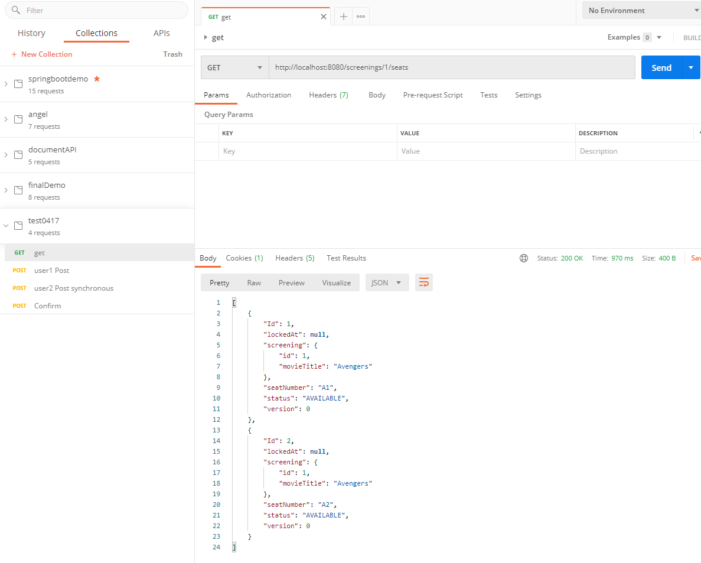
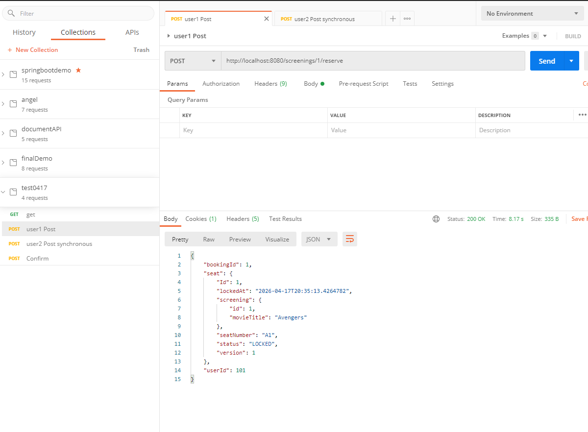
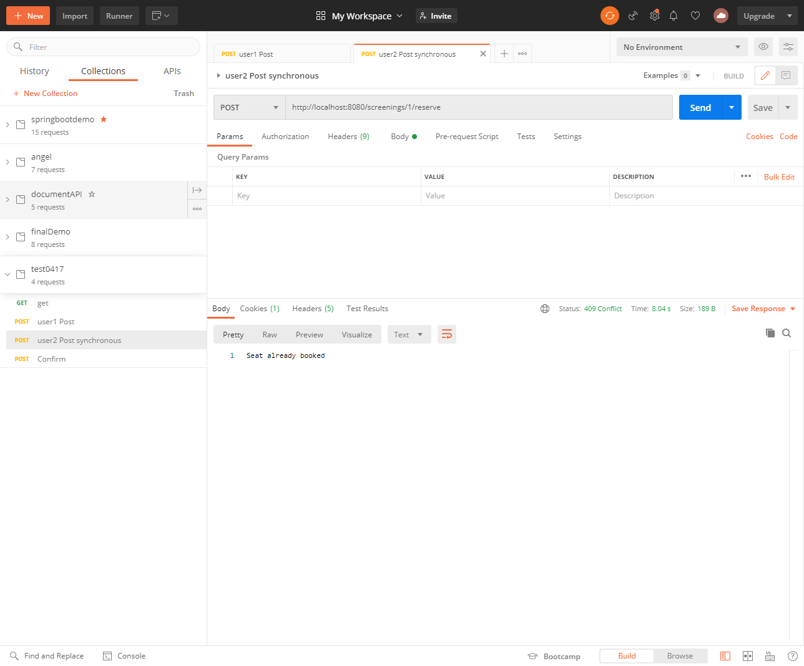
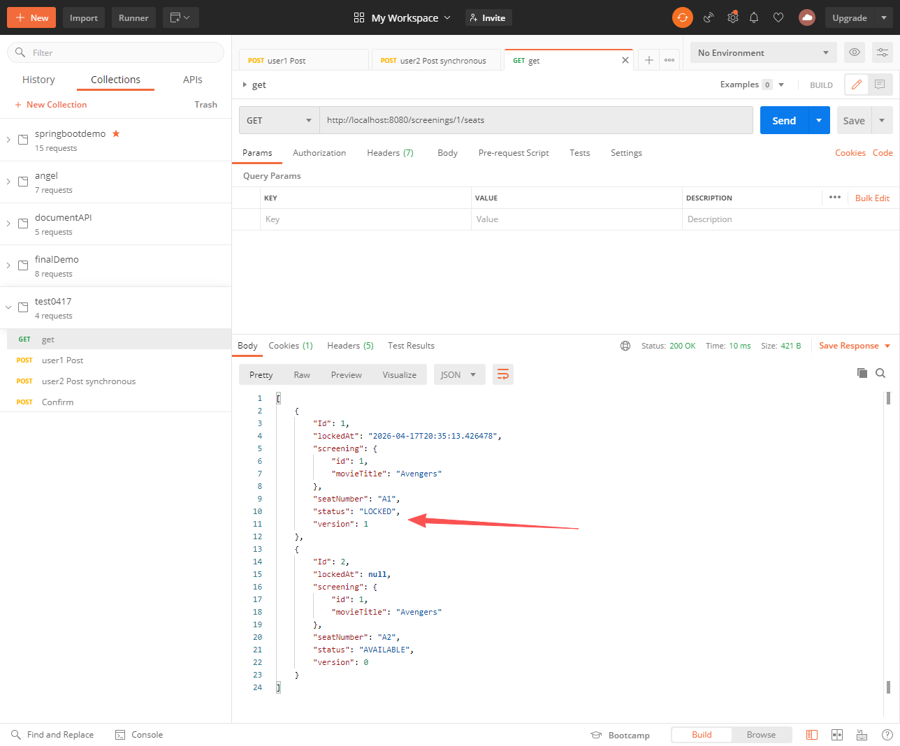
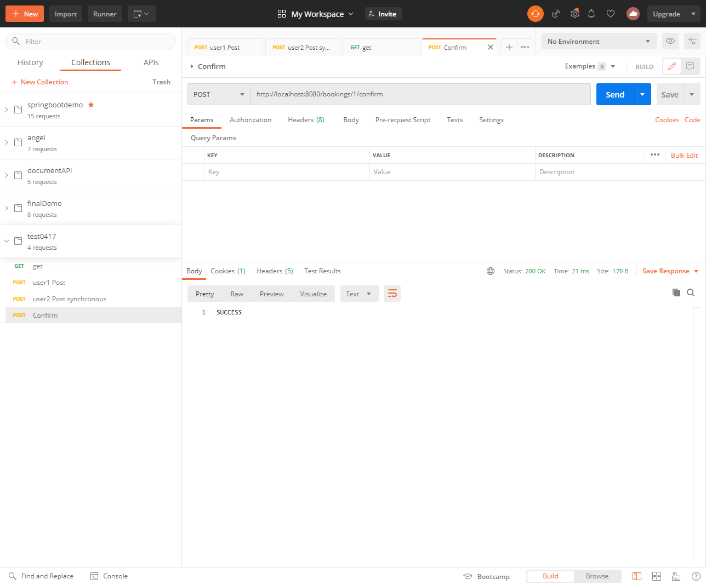
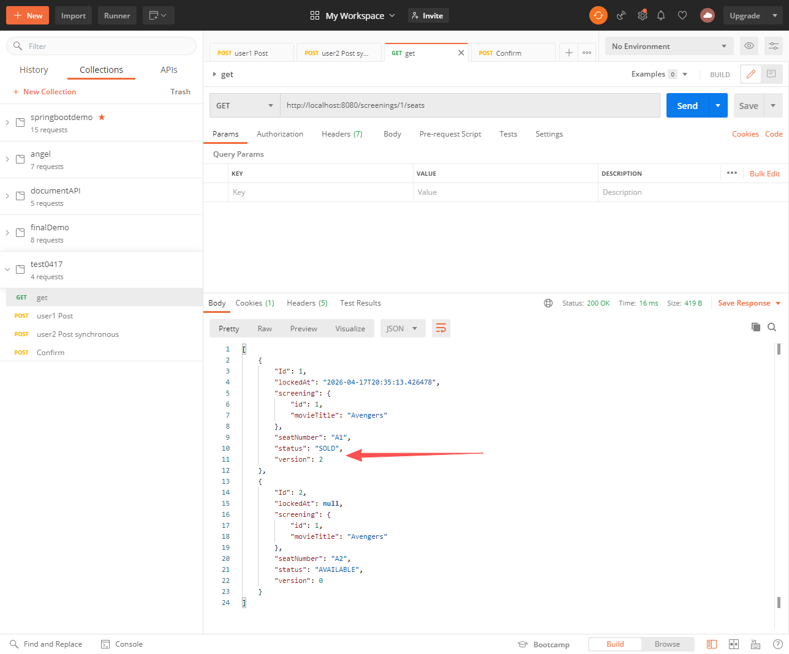

<h1>Spring Boot Final Examination: Cinema Seat Reservation System</h1>
<h3>1. Project Overview</h3>
   You are required to develop the core backend API for a Cinema Seat Reservation System. The system manages movie screenings, seat availability, and reservations. The primary challenge is to ensure data consistency: preventing "double-booking" where two users might attempt to reserve the same seat at the exact same millisecond.
<h3>2. Functional Requirements (API Endpoints)</h3>
   View Seats: GET /screenings/{id}/seats
   Return a list of all seats for a specific screening and their current status (AVAILABLE, LOCKED, or SOLD).

Reserve/Lock Seat: POST /screenings/{id}/reserve
   Payload: {"userId": 101, "seatId": "A1"}
   Rules: A seat can only be reserved if its status is AVAILABLE. Once reserved, it enters a LOCKED state.

Confirm Purchase: POST /bookings/{bookingId}/confirm
   Rules: Finalize the reservation by changing the status from LOCKED to SOLD.
<h3>3. Data Modeling</h3>
   Your database schema must include at least:
   Screening: id, movieTitle, startTime, hallName.
   Seat: id, seatNumber, status (Enum), screeningId, lockedAt (Timestamp), version (for locking).
   User: id, username.
<h3>4. Technical Requirements</h3>
   Layered Architecture: You must strictly follow the standard Spring Boot architecture:
   Controller: Handling HTTP requests/responses.
   Service: Implementing business logic and rules.
   Repository: Managing database interactions via Spring Data JPA.
   Entity: Defining the database schema.
   Database: Use H2 Database (In-memory) so the project can be run immediately without external setup.
   Concurrency: Implement a mechanism to handle Race Conditions (preventing two people from booking the same seat).
<h3>5. Critical Hints (Tips for Success)</h3>
   Concurrency Control: Simple if-statements are not enough for high-traffic scenarios. Research JPA Optimistic Locking (@Version) or Pessimistic Locking (@Lock) to ensure seat safety.
   Transactional Integrity: Use the @Transactional annotation in your Service layer to ensure that operations (like updating a seat and creating a booking record) are atomic.
   Data Initialization: Use a data.sql file or a CommandLineRunner bean to pre-populate the database with movies and seats so the system is testable upon startup.
   Validation: Implement basic error handling. For example, return a 409 Conflict or 400 Bad Request if a user tries to book a seat that is already taken.

---
这个题目考察的重点
1. 完成API请求
2. 在没有真实数据库情况下用H2和JPA依赖模拟数据库，同时配置初始化的sql模拟数据库数据
3. 用version字段和乐观锁Optimistic Locking (@Version) ，模拟多个users同时预定票的时候，只有一个人能提交成功

发送get请求

发送post请求

user2同时发送post请求

此时user1再次发送get请求

user1发送confirm请求

发送get请求查看座位已经sold

